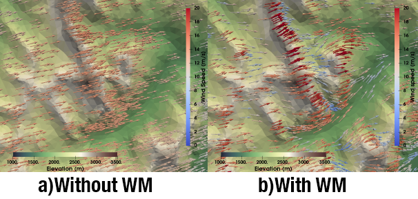

# Windmapper

Windmapper is a python tool and a set of algorithms for producing and using pre-computed libraries of wind field used for wind downscaling. 

# Installation
Ensure gdal system libraries are installed and then

``pip install windmapper``

# Documentation 
Documentation and full instructions on use can be found [here](https://windmapper.readthedocs.io/en/latest/)