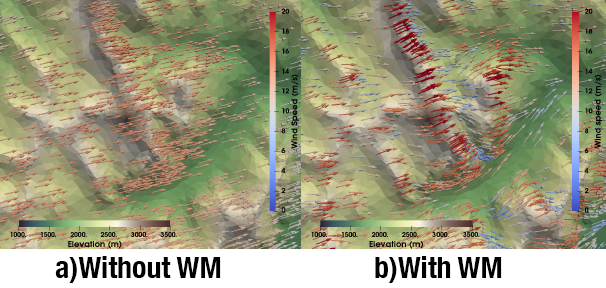

.. WindMapper documentation master file, created by
   sphinx-quickstart on Thu Jun 25 18:53:55 2020.
   You can adapt this file completely to your liking, but it should at least
   contain the root `toctree` directive.

Welcome to WindMapper's documentation!
======================================

Wind_mapper is a tool used to produce pre-computed libraries of wind
field used for wind downscaling. Wind_mapper uses the
`WindNinja <https://github.com/firelab/windninja>`__ wind diagnostic
model. It has been primarily developped for wind downscaling for the
Canadian Hydrological Model `CHM <https://github.com/Chrismarsh/CHM>`__.

.. toctree::
   :maxdepth: 2
   :caption: Contents:
   :hidden:

   build

Indices and tables
==================

* :ref:`genindex`
* :ref:`modindex`
* :ref:`search`
